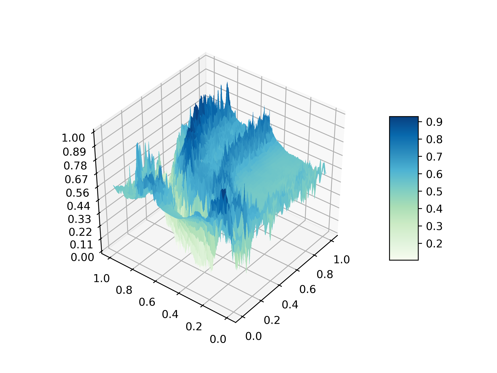
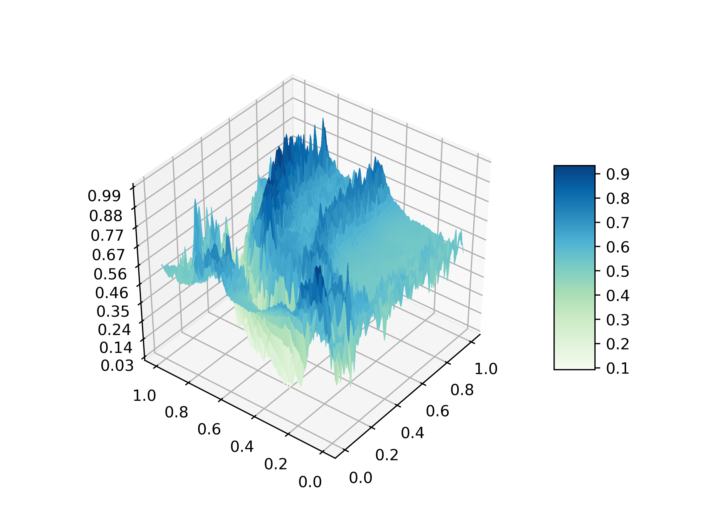

# Mariana Optimisation


[](https://www.youtube.com/watch?v=zJ4bPBKvtCw&feature=youtu.be)

I created this project to visualise different optimisation algorithms attempting to find the minimum point on a 2D surface. The surface I chose to use was a section of the Mariana trench, it has many local minima, steep cliffs and wide flat regions making it challenging for most algorithms.

## Dataset
- The data I used for the Mariana trench can be found <a href="https://data.noaa.gov//metaview/page?xml=NOAA/NESDIS/NGDC/MGG/DEM/iso/xml/4870.xml&view=getDataView&header=none#">here.</a>

- Details about the data can be found <a href="https://www.ngdc.noaa.gov/mgg/dat/dems/regional_tr/mariana_trench_6_msl_2012.pdf">here</a>.

I ended up cropping and scaling down a section of this data, ending up with a 1028x1028 image. To do this I used Matlab's ncread function: `data = ncread('mariana_trench_6_msl_2012.nc', 'band1');`. The other variable are shown <a href="https://www.ngdc.noaa.gov/thredds/dodsC/regional/mariana_trench_6_msl_2012.nc.html">here</a>.

## Approach
Since many optimisation algorithms require the gradient of the function they are trying to optimise I came up with a method to approximate the region of Mariana trench I had selected. I remembered a lecture from university about jpeg image compression, specifically how jpeg uses a discrete cosine transform as a basis for representing 8x8 pixel sections of an image. I used this approach to represent the jagged real Mariana trench data by a vector of weights for a cosine basis spanning the whole 'image'. I decided to use a basis for x with Fourier coefficients 0, 1,..., 100 and the same for y, a total of 10,000 basis functions (this is sufficient to obtain a reasonably high resolution). To solve for the weights of these functions I pick 160,000 points randomly on the image (1028x1028 = 1056784), call these points <strong>b</strong>. I then solve for the weights by <a href="http://math.mit.edu/~gs/linearalgebra/ila0403.pdf">least squares</a>. Consider the flattened (160,000 subset of the) coordinates <strong>c</strong> of the 1028x1028 grid (with x and y normalised to be in the range 0 and 1). I create the matrix <strong>A</strong> to be the matrix with rows corresponding to passing the coordinates <strong>c</strong> through each of the 10,000 basis functions. Then I compute the weights, <strong>x</strong> = [<strong>A</strong>^T<strong>A</strong>]<strong>A</strong>^T<strong>b</strong>. Finally I output a new 1028x1028 'soft' version of the original Mariana trench data by computing the weights <strong>x</strong> multiplied by the basis functions.

Real data           |  Smooth Mariana
:-------------------------:|:-------------------------:
 | 

I then demonstrate how different algorithms can be used to search for the minimum point of the surface. I have so far implemented the following algorithms:
- ABC (Artificial Bee Colony)
- Gradient Descent
- Adam (ADAptive Momentum estimation)
- Gibbs Sampling
- Metropolis Hastings
Of course this surface is not representative of the usual functions that these algorithms will be used to optimise, but it gives a good visualisation of the strengths and weaknesses of the algorithms on a low-dimensional, finite domain, complex multimodal function.

## Python Requirements
Use the package manager [pip](https://pip.pypa.io/en/stable/) to install the following (replacing PACKAGE by the name of the library).
- numpy
- matplotlib
- scipy
- PIL
- tqdm
- pylab

```bash
pip install PACKAGE
```
## Visualising
To view the algorithms in action I used Unity game engine, reading in the data I generated as a height-map for a terrain. The evaluations of the algorithms are displayed as coloured, emissive light sources; searching the domain of the function, trying to find the deepest point. To make the scene look more interesting I added a metal effect which you can find on the unity asset store <a href="https://assetstore.unity.com/packages/2d/textures-materials/metals/basic-metal-texture-pack-37402">here</a>.

## License
[MIT](https://choosealicense.com/licenses/mit/)
